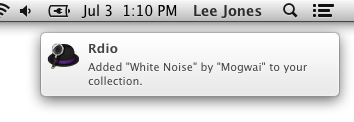
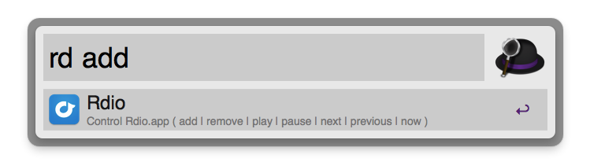

# Alfred Rdio Workflow

Control Rdio.app from Alfred including:

* add/remove the currently playing track from your collection
* play/pause
* next/previous

Includes output to Notification Center.

## Usage

	rd [command]

If no command is given, the workflow will launch Rdio.app (or bring it to the foreground if it is already launched).

## Commands

* `add` - add the currently playing track to your collection
* `remove` - remove the currently playing track from your collection and advance to the next track
* `play` - play the current track
* `pause` - pause the current track
* `next` - advance to the next track
* `previous` - return to the previous track
* `now` - show the current track and artist in Notification Center

## Requirements

* [Alfred v2](http://www.alfredapp.com)
* [Rdio.app](http://www.rdio.com/apps/)

## Installation

* Download the [latest release](/leejones/alfred-rdio-workflow/releases)
* Open the downloaded file and Alfred will import it automatically
